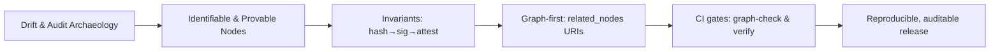

# DGP — Problem Statement

> **What breaks without DGP?** Content without identity, ornamental signatures, post‑hoc archaeology during audits, and releases that drift apart.

---

## 1) Symptoms we observe today

* **Docs/Code/Infra drift:** three views diverge; releases become non‑reproducible.
* **File‑centrism:** signatures bind to file locations rather than **canonical content** or **conceptual nodes**.
* **Weak audit trail:** CI metadata and build inputs are not captured; incident analysis turns into guesswork.
* **Brittle references:** `related_nodes` are mixed and unvalidated; orphan edges and illegal namespaces appear.
* **Non‑deterministic packaging:** timestamps/OS differences leak in; hashes and SBOMs fluctuate.

---

## 2) Root causes

* **Identity ≠ location:** file paths are treated as identity; both paths and content change.
* **Format‑bound signatures:** signing blobs ties trust to serialization quirks.
* **Missing graph discipline:** knowledge lives in folders, not **nodes + edges**; relations are optional.
* **Policy vacuum:** no namespace allowlist; no fail‑shut merge gates.

---

## 3) Requirements (what the solution must do)

1. **Content addressing:** canonicalize → `sha256`; make it the primary identity.
2. **Detached signatures:** sign the hash (e.g., via Vault Transit), keys behind policy.
3. **Attestation (light SLSA):** record who/what/when/inputs.
4. **Graph‑first model:** `related_nodes` are logical URIs (not file paths) with a namespace allowlist.
5. **Deterministic packaging:** reproducible tar + MANIFEST.
6. **CI gates:** orphan‑edge denial, namespace rules, hash/sig/attest verification on protected branches.

---

## 4) Non‑goals (what we **won’t** solve)

* No new “magic” container/format to learn.
* No lock‑in to a specific CI vendor.
* No forced repo reshuffle — we **overlay** graph/provenance invariants on the current tree.

---

## 5) Stakeholders & pain points

* **Developer:** “I can’t tell which document is the source of truth.”
* **Reviewer:** “Why did this edge change? What depends on it?”
* **Release engineer:** “I must reproduce exactly the same artifact.”
* **Security/Ops:** “Prove we shipped *this* precise content, not something else.”

---

## 6) Risks (short list)

| Risk                    | Impact                       | Mitigation                  |
| ----------------------- | ---------------------------- | --------------------------- |
| Orphan edges            | Inconsistent knowledge graph | `graph-check` orphan denial |
| Illegal namespaces      | Policy violations            | Namespace allowlist         |
| Non‑deterministic build | Non‑reproducible release     | Deterministic `package`     |
| Signing‑key exposure    | Broken provenance guarantees | Vault Transit, rotation     |

---

## 7) Minimal Viable DGP (MVDGP)

* `*.meta.yaml` → **logical ID** + `related_nodes` as **URIs**;
* `make graph-check` for allowlist + orphan detection;
* `make package` → MANIFEST; `make sign` → detached signature; `make verify` → unified verification;
* Protected branches only merge on green gates.

---

## 8) Acceptance criteria (DoD for the problem)

* The symptoms measurably reduce:

    * **orphans=0**, namespaces consistently applied;
    * reproducible package (same hash for same inputs);
    * attestation available for every release.

---

## 9) Fit within the book structure

* This chapter is **why‑focused**: it frames the pain and the expectations.
* Implementation unfolds in **02‑Principles**, **03‑Data Model**, **04‑Lifecycle**, **05‑CI Integration**.

---

## 10) Concept sketch (mermaid)

