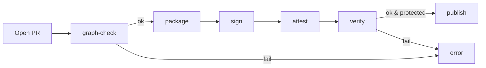

# DGP — CI Integration (EN)

> **Goal:** execute DGP principles (hash → signature → attestation, graph‑gates) **automatically** and **consistently** on any CI system.

---

## 0) Overview (where we are, where we go)

Turn DGP gates into CI steps:

1. **Graph‑lint** — validate `related_nodes` (orphans, namespaces, URI grammar)
2. **Canon + package** — canonicalize → deterministic tar → `MANIFEST.sha256`
3. **Sign** — detached signature over `MANIFEST.sha256` (Vault Transit / HSM)
4. **Attest** — capture CI metadata & inputs (`attestation.json`)
5. **Verify** — recompute hash + verify signature + validate attestation + enforce policy
6. **Publish** — upload artifacts, record anchors

> **Policy:** on protected branches steps 1–5 are **blocking**; elsewhere evolve from "warning→error".

---

## 1) Make targets (reference)

```make
# Graph validation
graph-check:
	./tools/graph_lint \
	  --allowlist infra/policy/graph-provenance.policy.yaml \
	  --fail-on=orphans,illegal-namespace

# Deterministic package
package:
	./tools/canon && \
	tar --sort=name --mtime='UTC 2020-01-01' -cf build/artifacts.tar $(ARTIFACTS)
	sha256sum build/artifacts.tar > build/MANIFEST.sha256

# Detached signature
sign:
	./tools/sign_vault --in build/MANIFEST.sha256 --out build/MANIFEST.sha256.sig

# Attestation
attest:
	./tools/attest --manifest build/MANIFEST.sha256 --out build/attestation.json

# Unified verification
verify:
	./tools/verify_all \
	  --manifest build/MANIFEST.sha256 \
	  --sig build/MANIFEST.sha256.sig \
	  --att build/attestation.json \
	  --policy infra/policy/graph-provenance.policy.yaml
```

---

## 2) Pipeline sketch (vendor‑agnostic)

**Main flow:** `graph-check` → `package` → `sign` → `attest` → `verify` → (conditional) `publish`.

**Parallelism:** run `graph-check` early for fast feedback. Run `verify` only after `sign` and `attest`.

**Fail‑fast:** make `graph-check` and `verify` error out quickly; don’t waste time on later steps.

---

## 3) Example: GitHub Actions (excerpt)

```yaml
name: dgp-pipeline
on:
  pull_request:
  push:
    branches: [ main, golang/main ]

jobs:
  dgp:
    runs-on: ubuntu-latest
    permissions:
      contents: read
      id-token: write  # if OIDC is used for Vault access
    steps:
      - uses: actions/checkout@v4
      - name: Graph lint
        run: make graph-check
      - name: Package (deterministic)
        run: make package
      - name: Sign MANIFEST
        env:
          VAULT_ADDR: ${{ secrets.VAULT_ADDR }}
          VAULT_TOKEN: ${{ secrets.VAULT_TOKEN }}
        run: make sign
      - name: Attest CI metadata
        run: make attest
      - name: Verify all
        run: make verify
      - name: Publish artifacts
        if: github.ref == 'refs/heads/main' && success()
        uses: actions/upload-artifact@v4
        with:
          name: dgp-bundle
          path: |
            build/artifacts.tar
            build/MANIFEST.sha256
            build/MANIFEST.sha256.sig
            build/attestation.json
```

---

## 4) Example: GitLab CI (excerpt)

```yaml
stages: [lint, package, sign, attest, verify, publish]

variables:
  GIT_STRATEGY: clone

lint:graph:
  stage: lint
  script: ["make graph-check"]
  rules:
    - if: $CI_PIPELINE_SOURCE == "merge_request_event"

package:
  stage: package
  script: ["make package"]

sign:
  stage: sign
  script:
    - make sign
  secrets:
    # Configure Vault/Transit integration here

attest:
  stage: attest
  script: ["make attest"]

verify:
  stage: verify
  script: ["make verify"]
  allow_failure: false

publish:
  stage: publish
  rules:
    - if: $CI_COMMIT_BRANCH == "main"
  script:
    - echo "publishing artifacts"
    - ls -l build/
  artifacts:
    paths:
      - build/artifacts.tar
      - build/MANIFEST.sha256
      - build/MANIFEST.sha256.sig
      - build/attestation.json
    expire_in: 90 days
```

---

## 5) Secrets & key policy

* **Transit / HSM:** signing keys never leave the security boundary.
* **Short‑lived:** OIDC‑bound, context‑scoped tokens; expire at job end.
* **Separation:** per‑environment keyrings (dev/stage/prod).
* **Audit:** signature logs, rotation logs, periodic reviews.

> **Antipattern:** long‑lived, manually distributed `VAULT_TOKEN`s on developer machines.

---

## 6) Artifacts & retention

* **Required:** `artifacts.tar`, `MANIFEST.sha256`, `MANIFEST.sha256.sig`, `attestation.json`.
* **Retention:** at least 90 days; longer for releases (e.g., 1–3 years).
* **Meta linkage:** node `*.meta.yaml` may optionally record anchor URIs.

---

## 7) Performance & caching

* **Canon cache:** cache the canonical byte stream (or computed hash) for unchanged inputs.
* **Tar cache:** deterministic ordering makes it cache‑friendly; invalidate on input changes.
* **CI cache:** key by commit SHA + environment fingerprint.

---

## 8) Parallelism & ordering

* **PRs:** run `graph-check` in parallel for fast feedback.
* **Release:** only run `verify` after `sign` and `attest`.
* **Gates:** enforce branch protection + green status checks.

---

## 9) Troubleshooting & diagnostics

| Symptom                          | Likely cause                    | Action                              |
| -------------------------------- | ------------------------------- | ----------------------------------- |
| `graph-check` fails (orphan)     | missing target node             | create it / fix URI                 |
| `graph-check` fails (namespace)` | disallowed prefix               | extend allowlist or correct URI     |
| `verify` fails (hash)            | canonicalization drift          | normalize line endings/mtime        |
| `verify` fails (sig)             | Transit permission/token issues | fix RBAC, OIDC, rotation            |
| `verify` fails (attest)          | missing/invalid attestation     | enforce schema, make step mandatory |

---

## 10) Rollout strategy (warning → error)

1. **Week 0:** `graph-check` in warning mode; collect metrics (orphan rate, illegal namespaces).
2. **Week 2:** introduce `verify` (still warning).
3. **Week 4:** make `graph-check` **blocking** on protected branches.
4. **Week 6:** make `verify` **blocking**; unify retention + publishing.
5. **Week 8:** tighten thresholds (orphan rate → 0, density guards, mandatory `@vN` version tag).

---

## 11) Metrics (DoD‑oriented)

* **Orphan rate:** how many new edges end up orphaned.
* **Namespace compliance:** how many references violate policy.
* **Reproducibility:** same inputs → same hash ratios.
* **Gate health:** `graph-check` / `verify` pass‑rates on protected branches.

---

## 12) Mermaid — pipeline overview



---

## 13) Definition of Done (for this chapter)

* On protected branches `graph-check` and `verify` are **blocking** and **green**.
* Required artifacts are **published** and retained audibly.
* Secret management is vendor‑agnostic and least‑privileged.
* Metrics are measurable; drift is **caught** by gates.
