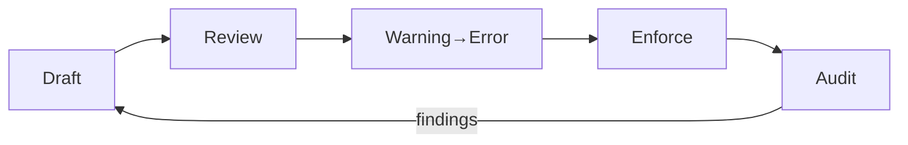

# DGP — Policies (EN)

> **Purpose:** state and enforce the rules that guarantee graph and provenance quality. A policy is not a hurdle — it’s a **gate that preserves proof**.

---

## 0) Scope

* **Graph rules:** `related_nodes` URI grammar, namespace allowlist, orphan‑edge denial, cycle handling.
* **Provenance rules:** required anchors (hash/sig/attest), signing key policy, attestation schema.
* **Release rules:** mandatory artifacts (MANIFEST, SIG, ATTEST), retention, fail‑shut merge gates.
* **Change management:** waivers (exceptions), expirations, audit.

---

## 1) Namespaces & URIs (mandatory)

**Rule:** entries in `related_nodes` are **logical URIs** from approved namespaces.

* **Allowed:** `schema://`, `doc://`, `module://`, `policy://`, `hash://sha256/`, `sig://vault-transit/`, `attest://`
* **Forbidden:** relative/absolute file paths (`../`, `/home/user/...`), mixed case, spaces.
* **Versioning:** recommended for logical nodes: `@vN`.

**Regex sketch:**

```regex
^(schema|doc|module|policy)://[a-z0-9:/\-]+(@v\d+)?$
```

---

## 2) Required anchors (hash/sig/attest)

**Rule:** every releasable node must have at least a **hash** anchor; on protected branches **hash + sig + attest** are required.

* **Hash:** `hash://sha256/<64hex>` — over canonicalized content.
* **Signature:** `sig://vault-transit/<key>` — detached signature, behind Transit/HSM.
* **Attestation:** `attest://<scheme>/<desc>` — records CI metadata and inputs.

---

## 3) Edge hygiene & density

* **Orphans:** disallowed — every referenced target must exist.
* **Illegal edges:** disallowed — targets must come from allow‑listed namespaces.
* **Density guard (optional):** warn/error on excessive in/out degree to avoid spaghetti.

**Example thresholds:**

* max out‑degree per node: 30 (warn), 60 (error)
* max in‑degree: 200 (warn), 400 (error)

---

## 4) Branch protection & status gates

* **Protected branches:** `graph-check` and `verify` are **blocking** status checks.
* **Non‑protected branches:** start in warning mode → time‑boxed cutover to error.
* **Release tags:** extend policy: retention ≥ 90 days; meta links recommended.

---

## 5) Waiver (exception) process

Exceptions are rare; when needed, they must be **visible, time‑bounded, and reviewable**.

1. Request in PR: rationale + duration + affected rules.
2. Approvers: **at least 2** (one from security/compliance, one from owning team).
3. Expiration: max 30 days; automatic reminders.
4. Logging: waiver registry with review dates.

**Waiver meta example:**

```yaml
waiver:
  id: waiver://graph/namespace-exception/2025-09-27
  rule: policy.graph.namespace-allowlist
  expires: 2025-10-27
  approvers: [ team://cic-core, team://sec ]
  reason: "Legacy doc path, migration in progress"
```

---

## 6) Policy file (example v1)

`infra/policy/graph-provenance.policy.yaml`

```yaml
apiVersion: cic/policy/v1
kind: GraphNamespaceAllowlist
metadata:
  name: graph-namespace-allowlist
spec:
  allowed_prefixes:
    - schema://
    - doc://
    - module://
    - policy://
    - hash://sha256/
    - sig://vault-transit/
    - attest://
  rules:
    forbid_mixed_case_ids: true
    forbid_spaces: true
    allowed_separators: ["-", "/", ":"]
    require_versions: true    # prefer @vN on logical nodes
    max_out_degree:
      warn: 30
      error: 60
    max_in_degree:
      warn: 200
      error: 400
```

**OPA/Rego extension (optional):**

```rego
package dgp.graph

default allow = false
allow {
  input.node.kind == "doc"
  startswith(input.edge.target, "schema://")
}
```

---

## 7) Change management (policy versioning)

* Policy files are **versioned** (e.g., `apiVersion: cic/policy/v1`).
* Breaking change: bump major, communicate, and apply grace period (warning → error).
* Policy release notes: what changed, who is affected, when it becomes mandatory.

---

## 8) Telemetry & metrics

* **Orphan rate:** (orphan edges / new edges) × 100%.
* **Illegal namespace rate:** (rejected edges / all edges).
* **Gate latency:** median PR time; failures by rule/reason.
* **Conformance:** missing‑hash/sig/attest ratios.

---

## 9) Audit & logging

* Waiver log + expiry reports.
* Signature events (Transit audit log).
* Attestation validation stats.
* Policy version history and rollout dates.

---

## 10) Mermaid — Policy lifecycle



---

## 11) CI integration

* Pass the policy file to `graph-check` (`--allowlist ...`).
* Treat policy violations as **blocking** failures in `verify`.
* Policy tests: dedicated job with curated good/bad samples (unit tests for the linter).

---

## 12) Definition of Done (for this chapter)

* Versioned policy file(s) live in the repo; CI steps **consume** them.
* Waiver process is documented, expiring, and audited.
* Gates consistently enforce namespaces, edge hygiene, and anchor requirements.
* Metrics are measurable and trended; drift is surfaced early.
