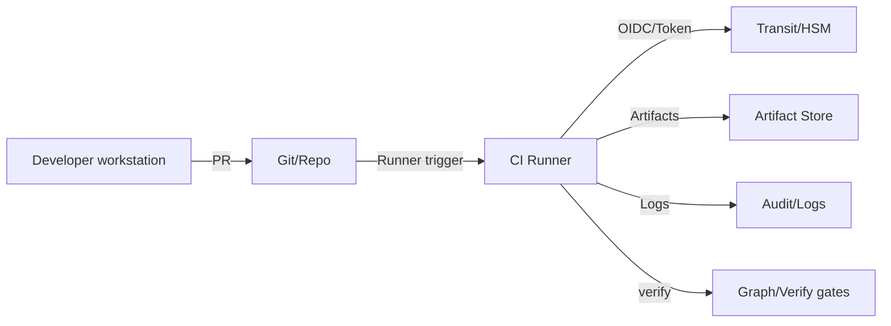

# DGP — Threat Model (EN)

> **Objective:** identify, rank, and mitigate risks that could compromise the DGP chain (hash → signature → attestation) and graph discipline.
> **Approach:** vendor‑neutral, **STRIDE‑inspired**, proof‑first.

---

## 0) Scope & assumptions

**Scope:** logical nodes (docs / schemas / modules), CI build chain, artifact store, key service (Vault Transit/HSM), policy gates.

**Assumptions (trust baseline):**

* Signing keys **never** leave Transit/HSM; access is protected via RBAC + short‑lived tokens.
* CI runners may be compromised **at runtime**, but hold no persistent infra admin rights.
* VCS (git) mutations are **visible** (audit logs), branch protection is enabled.
* Teams honor **policy gates** (protected branch = blocking status checks).

**Out of scope:** end‑user devices, network perimeter, confidentiality controls (DGP focuses on **integrity**).

---

## 1) Assets

* **Provenance evidence:** `MANIFEST.sha256`, `*.sig`, `attestation.json`.
* **Key material:** signing keys in Transit/HSM, access tokens.
* **Logical graph:** `*.meta.yaml`, `related_nodes`, policy files.
* **Artifacts:** deterministic package (`artifacts.tar`).

---

## 2) Adversaries & goals

* **Supply‑chain attacker:** ships a malicious change unnoticed.
* **Insider abuse:** bypasses policy, misuses waivers, exfiltrates secrets.
* **Benign error:** non‑deterministic build, bad URI, orphan edges.

**Motivations:** violate release integrity, mislead audits, prevent deterministic rollback.

---

## 3) STRIDE matrix (DGP view)

| Category                   | Example threat                  | Consequence                     | DGP countermeasure                                           |
| -------------------------- | ------------------------------- | ------------------------------- | ------------------------------------------------------------ |
| **S**poofing               | Posing as a legitimate signer   | Fake “green” release            | Transit/HSM, short‑lived tokens, `verify` key identity check |
| **T**ampering              | Modifying MANIFEST or artifact  | Hash mismatch, hidden injection | Canon+hash, detached sig, `verify` fail‑shut                 |
| **R**epudiation            | Denying authorship of a release | Missing auditability            | Attestation (who/what/when/inputs), immutable logs           |
| **I**nfo disclosure        | Leaking keys/metadata           | Key misuse, profiling           | Least‑privilege, leak‑lint, secrets‑store RBAC               |
| **D**enial of service      | Stopping gates from running     | Delayed release                 | Fail‑fast diagnostics, waiver without bypass                 |
| **E**levation of privilege | Runner privilege escalation     | Unauthorized signing            | OIDC binding, scoped roles, network policy                   |

---

## 4) Attack paths (kill‑chain style)

1. **Source manipulation:** inject illegal URIs or orphan edges in PR → **graph‑check** blocks.
2. **Build manipulation:** mtime/line‑ending/ZIP tricks → **deterministic packaging** + hash comparison fails.
3. **Signature subversion:** use local keys → **detached sig + Transit** (no local keys), runner‑bound tokens.
4. **Attestation forgery:** hand‑crafted JSON upload → **verify** schema check + commit/run ID binding.
5. **Gate bypass:** push to non‑protected branch → **branch protection** + release rules.

---

## 5) Control set (requirement → control)

* **Integrity anchor:** canonical `sha256` → `hash://sha256/<digest>` required.
* **Detached signature:** `sig://vault-transit/<key>`; keys **never** leave the service.
* **Attestation:** `attest://…`; CI run id + inputs; schema‑validated in `verify`.
* **Graph gates:** `graph-check` for orphan/namespace/URI lint; **blocking** on protected branches.
* **Waiver process:** time‑boxed, two approvers, visible registry.
* **Artifact retention:** MANIFEST + SIG + ATTEST ≥ 90 days (releases: 1–3 years).

---

## 6) Security architecture — trust boundaries

**Note:** key operations only in Vault; runners **do not** hold key material.

---

## 7) Common failure modes & defenses

| Symptom             | Cause                              | Mitigation                                       |
| ------------------- | ---------------------------------- | ------------------------------------------------ |
| Hash mismatch       | Non‑deterministic canonicalization | Fixed mtime, `\n` endings, forbid BOM            |
| Sig missing/invalid | Transit access / token issues      | RBAC, short‑lived tokens, rotation, retry policy |
| Attest invalid      | Schema mismatch / missing fields   | Schema lint, include PR link + run id            |
| Orphan edge         | Wrong target URI                   | `graph-check` blocks; send PR back               |
| Namespace violation | Disallowed prefix                  | Extend allowlist → review → commit               |

---

## 8) Early‑warning metrics

* **Orphan rate**, **illegal namespace** counts.
* **Deterministic hash match** ratio.
* **Gate‑fail trends** by cause (hash/sig/attest/graph).
* **Waiver inventory:** active exceptions, expirations.

---

## 9) Incident response notes

* **Fast truth:** run `verify_all` on the suspect release → yes/no answer.
* **Blast radius:** traverse the graph from the affected node (in/out edges).
* **Rollback:** restore last‑known‑good via MANIFEST hash deterministically.

---

## 10) Definition of Done (for this chapter)

* A **STRIDE matrix** and **kill‑chain** view exist for DGP.
* Controls align with chapters 02–06 and are measurable in CI.
* “Green state” = controls active + metrics trending positive.
