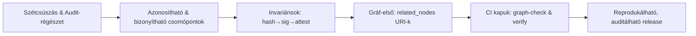

# DGP — Probléma‑megfogalmazás

> **Mi a gond, ha nincs DGP?** Identitás nélküli tartalom, dísznek szánt aláírások, utólagos régészet az auditnál, és széteső kiadások.

---

## 1) Tünetek a jelenlegi állapotban

* **Drift a doksi/kód/infra között:** a három nézet eltér; a release nem reprodukálható.
* **File‑centrikus gondolkodás:** az aláírás a fájlhoz kötődik, nem a **tartalomhoz** és nem a **fogalmi csomóponthoz**.
* **Gyenge auditnyom:** CI‑meták és build‑inputok nem követhetők; „kitalálósdi” egy incidens után.
* **Törékeny hivatkozások:** a `related_nodes` vegyes formátumú, nem ellenőrzött; árvák és tiltott névterek jelenhetnek meg.
* **Nem determinisztikus csomagolás:** időbélyeg/OS‑függő különbségek; hash és SBOM ingadozik.

---

## 2) Gyökérokok

* **Identitás ≠ hely:** fájlútvonalat tekintünk azonosítónak; a tartalom változik, az útvonal is.
* **Formátumfüggő aláírás:** fájl‑blob aláírása → egy apró formázás is láncszakítást okoz.
* **Gráf hiánya:** a tudás nem **csomópontok+élek** formájában él, hanem mappákban; a kapcsolatok nincsenek kényszerítve.
* **Policy‑vákuum:** nincs névtér‑allowlist, nincs „fail‑shut” merge‑gate.

---

## 3) Követelmények (mit kell tudnia a megoldásnak?)

1. **Tartalom‑címzés:** kanonizálás → `sha256`; ez legyen az elsődleges identitás.
2. **Leválasztott aláírás:** a hash aláírása (pl. Vault Transit), kulcsok policy mögött.
3. **Attesztáció (light SLSA):** ki/mi/mikor/bemenetek rögzítése.
4. **Gráf‑első modell:** `related_nodes` logikai URI‑k (nem fájlutak), névtér‑allowlisttel.
5. **Determinista csomagolás:** reprodukálható tar + MANIFEST.
6. **CI‑kapuk:** árva‑él tilalom, névtér‑szabályok, hash/sig/attest verifikáció protected brancheken.

---

## 4) Anti‑célok (amit **nem** oldunk meg)

* Nem vezetünk be új „varázs” csomagformátumot;
* Nem kötjük a rendszert egyetlen CI‑szolgáltatóhoz;
* Nem írjuk felül az eddigi mappastruktúrát — **rátelepülünk** gráf‑ és proveniencia‑invariánsokkal.

---

## 5) Érintettek és fájdalompontok

* **Fejlesztő:** „nem tudom, melyik dokumentáció igaz”.
* **Reviewer:** „miért változott ez az él? mi kapcsolódik hozzá?”
* **Release‑mérnök:** „ugyanazt a csomagot akarom újra előállítani”.
* **Biztonság/üzemeltetés:** „bizonyítsd, hogy ezt a konkrét tartalmat adtuk ki, nem mást”.

---

## 6) Kockázatok (rövid)

| Kockázat                   | Hatás                      | Kezelés                    |
| -------------------------- | -------------------------- | -------------------------- |
| Árvák a gráfban            | Inkonszisztens tudás       | `graph-check` árva‑tilalom |
| Illegális névterek         | Szabályszegő hivatkozás    | névtér‑allowlist           |
| Nem determinisztikus build | Nem reprodukálható release | determinisztikus `package` |
| Aláírási kulcs kockázat    | Bizonyíthatóság sérül      | Vault Transit, rotáció     |

---

## 7) Minimal Viable DGP (MVDGP)

* `*.meta.yaml` → **logikai ID** + `related_nodes` **URI‑ként**;
* `make graph-check` a névtér‑allowlistre és árva‑detektálásra;
* `make package` → MANIFEST; `make sign` → leválasztott aláírás; `make verify` → egységes ellenőrzés;
* Protected branch csak zöld kapuk mellett.

---

## 8) Elfogadási kritériumok (DoD a problémára)

* A fenti tünetek mérhetően csökkennek:

    * **árvák=0**, névterek konzisztens használata;
    * reprodukálható csomag (azonos hash azonos bemenetekre);
    * attesztáció rendelkezésre áll minden kiadáshoz.

---

## 9) Illeszkedés a könyvszerkezethez

* Ez a fejezet **miért‑központú**: a „mi fáj?” és „mit várunk el?” leírása.
* A megoldási részletek a **02‑Elvek**, **03‑Adatmodell**, **04‑Életciklus**, **05‑CI integráció** fejezetekben bontódnak ki.

---

## 10) Fogalmi vázlat (mermaid)

