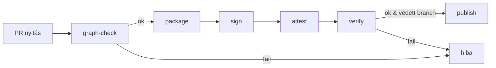

# DGP — CI integráció (HU)

> **Cél:** a DGP elveit (hash → aláírás → attesztáció, gráf‑kapuk) **automatizáltan** és **következetesen** végrehajtani bármely CI rendszeren.

---

## 0) Áttekintés (hol tartunk, hova megyünk)

A DGP‑kapuk a következő lépésekből állnak, CI‑lépésekké fordítva:

1. **Graph‑lint** — `related_nodes` ellenőrzése (árvák, névterek, URI‑szabályok)
2. **Canon + package** — kanonizálás → determinisztikus tar → `MANIFEST.sha256`
3. **Sign** — `MANIFEST.sha256` leválasztott aláírása (Vault Transit / HSM)
4. **Attest** — CI‑meta és inputok rögzítése (`attestation.json`)
5. **Verify** — hash újraszámolás + aláírás + atteszt + policy
6. **Publish** — artefaktok közzététele, horgonyok hivatkozása

> **Elv:** protected brancheken a 1–5. lépés **blokkoló**; máshol fokozatosan „warning→error”.

---

## 1) Make célok (referencia)

```make
# Gráf ellenőrzés
graph-check:
	./tools/graph_lint \
	  --allowlist infra/policy/graph-provenance.policy.yaml \
	  --fail-on=orphans,illegal-namespace

# Determinisztikus csomag
package:
	./tools/canon && \
	tar --sort=name --mtime='UTC 2020-01-01' -cf build/artifacts.tar $(ARTIFACTS)
	sha256sum build/artifacts.tar > build/MANIFEST.sha256

# Leválasztott aláírás
sign:
	./tools/sign_vault --in build/MANIFEST.sha256 --out build/MANIFEST.sha256.sig

# Attesztáció
attest:
	./tools/attest --manifest build/MANIFEST.sha256 --out build/attestation.json

# Egységes ellenőrzés
verify:
	./tools/verify_all \
	  --manifest build/MANIFEST.sha256 \
	  --sig build/MANIFEST.sha256.sig \
	  --att build/attestation.json \
	  --policy infra/policy/graph-provenance.policy.yaml
```

---

## 2) Pipeline váz (vendor‑agnosztikus)

**Fő lépések:** `graph-check` → `package` → `sign` → `attest` → `verify` → (feltétel) `publish`.

**Paralelizálás:** a `graph-check` futhat korán (gyors visszajelzés). A `verify` csak `sign` és `attest` után.

**Gyors bukás:** a `graph-check` és a `verify` legyen „fail‑fast” – ne égesse az időt a későbbi lépésekre.

---

## 3) Példa: GitHub Actions (részlet)

```yaml
name: dgp-pipeline
on:
  pull_request:
  push:
    branches: [ main, golang/main ]

jobs:
  dgp:
    runs-on: ubuntu-latest
    permissions:
      contents: read
      id-token: write  # ha OIDC szükséges a Vault‑hoz
    steps:
      - uses: actions/checkout@v4
      - name: Graph lint
        run: make graph-check
      - name: Package (deterministic)
        run: make package
      - name: Sign MANIFEST
        env:
          VAULT_ADDR: ${{ secrets.VAULT_ADDR }}
          VAULT_TOKEN: ${{ secrets.VAULT_TOKEN }}
        run: make sign
      - name: Attest CI metadata
        run: make attest
      - name: Verify all
        run: make verify
      - name: Publish artifacts
        if: github.ref == 'refs/heads/main' && success()
        uses: actions/upload-artifact@v4
        with:
          name: dgp-bundle
          path: |
            build/artifacts.tar
            build/MANIFEST.sha256
            build/MANIFEST.sha256.sig
            build/attestation.json
```

---

## 4) Példa: GitLab CI (részlet)

```yaml
stages: [lint, package, sign, attest, verify, publish]

variables:
  GIT_STRATEGY: clone

lint:graph:
  stage: lint
  script: ["make graph-check"]
  rules:
    - if: $CI_PIPELINE_SOURCE == "merge_request_event"

package:
  stage: package
  script: ["make package"]

sign:
  stage: sign
  script:
    - make sign
  secrets:
    # Vault/Transit integráció itt kezelhető

attest:
  stage: attest
  script: ["make attest"]

verify:
  stage: verify
  script: ["make verify"]
  allow_failure: false

publish:
  stage: publish
  rules:
    - if: $CI_COMMIT_BRANCH == "main"
  script:
    - echo "publishing artifacts"
    - ls -l build/
  artifacts:
    paths:
      - build/artifacts.tar
      - build/MANIFEST.sha256
      - build/MANIFEST.sha256.sig
      - build/attestation.json
    expire_in: 90 days
```

---

## 5) Titokkezelés és kulcspolitika

* **Transit / HSM:** aláíró kulcsok nem hagyják el a biztonsági határvonalat.
* **Rövid élettartam:** OIDC‑alapú, kontextushoz kötött tokenek; futtatás végén lejárnak.
* **Elkülönítés:** környezetenként külön kulcs (dev/stage/prod), külön „keyring”.
* **Audit:** aláírások logolása, kulcsrotációs napló, szabályos revíziók.

> **Anti‑minta:** állandó, kézzel kiosztott VAULT_TOKEN fejlesztői gépekre.

---

## 6) Artefaktok és megőrzés

* **Kötelező:** `artifacts.tar`, `MANIFEST.sha256`, `MANIFEST.sha256.sig`, `attestation.json`.
* **Retention:** legalább 90 nap, kiadásoknál hosszabb (pl. 1–3 év).
* **Meta‑hivatkozás:** a `*.meta.yaml` opcionálisan tartalmazhatja az anchor URI‑kat.

---

## 7) Teljesítmény és cache

* **Canon cache:** a kanonizált bájtfolyamot (vagy a kiszámított hash‑t) cache‑eld változatlan bemenetekre.
* **Tar cache:** stabil sorrend miatt jól cache‑elhető; invalidálás bemenő fájlváltozásra.
* **CI cache:** kulcsolj commit SHA + környezeti fingerprint alapján.

---

## 8) Párhuzamosság és sorbarendezés

* **PR‑ek:** a `graph-check` futhat párhuzamosan, gyors visszajelzést adva.
* **Release:** `verify` csak akkor induljon, ha `sign` és `attest` sikeres volt.
* **Sorompók:** branch‑védelem + státuszellenőrzés (status checks) kötelezően zöld.

---

## 9) Hibakezelés és diagnosztika

| Jelenség                    | Valószínű ok                | Teendő                                  |
| --------------------------- | --------------------------- | --------------------------------------- |
| `graph-check` fail (árva)   | hiányzó célcsomópont        | hozd létre / javítsd az URI‑t           |
| `graph-check` fail (névtér) | nem engedélyezett prefix    | policy bővítés vagy URI korrekció       |
| `verify` fail (hash)        | kanonizálási eltérés        | sorvégek/mtime normalizálása            |
| `verify` fail (sig)         | Transit jogosultság / token | RBAC, OIDC, kulcsrotáció ellenőrzése    |
| `verify` fail (attest)      | hiányzó/hibás attesztáció   | séma‑validáció, pipeline lépés kötelező |

---

## 10) Bevezetési stratégia (warning → error)

1. **0. hét:** `graph-check` figyelmeztető módban; metrikák gyűjtése (árva‑ráta, illegális névterek).
2. **2. hét:** `verify` bevezetése, még warning módban.
3. **4. hét:** protected brancheken `graph-check` **blokkoló**.
4. **6. hét:** `verify` is **blokkoló**; retenció + publikálás egységesítése.
5. **8. hét:** küszöbök szigorítása (árva‑ráta → 0, sűrűség‑gátak, kötelező verzió‑tag `@vN`).

---

## 11) Mérőszámok (DoD‑orientált)

* **Árva‑ráta:** új edge‑ek közül hány árvul el (cél hiányzik).
* **Névtér megfelelés:** hány hivatkozás lép politikát.
* **Reprodukálhatóság:** azonos bemenet → hash egyezés aránya.
* **Kapuk állapota:** `graph-check` / `verify` pass‑rate protected brancheken.

---

## 12) Mermaid — pipeline áttekintés



---

## 13) Definition of Done (ehhez a fejezethez)

* Protected brancheken a `graph-check` és `verify` **blokkoló** és **zöld**.
* A kötelező artefaktok **publikálva** és auditálhatóan megőrizve.
* A titokkezelés vendorfüggetlen és legkisebb jogosultságot követ.
* Mérőszámok mérhetők; drifteket a kapuk **megfogják**.
