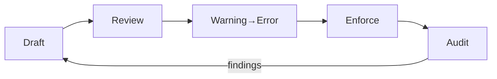

# DGP — Policy‑k (HU)

> **Feladat:** kimondani és kikényszeríteni azokat a szabályokat, amelyek garantálják a gráf és a proveniencia minőségét. A policy nem akadály — **bizonyíték‑őrző kapu**.

---

## 0) Mi a scope?

* **Gráf‑szabályok:** `related_nodes` URI‑grammatika, névtér‑allowlist, árva‑él tiltás, körök kezelése.
* **Proveniencia‑szabályok:** kötelező horgonyok (hash/sig/attest), aláírási kulcspolitika, attesztációs séma.
* **Kiadási‑szabályok:** artefakt‑kötelezők (MANIFEST, SIG, ATTEST), retenció, „fail‑shut” merge‑gatek.
* **Változáskezelés:** kivételek (waiver), lejáratuk, audit.

---

## 1) Névterek és URI‑k (kötelező)

**Szabály:** a `related_nodes` **logikai URI**, engedélyezett prefixekkel.

* Engedélyezett: `schema://`, `doc://`, `module://`, `policy://`, `hash://sha256/`, `sig://vault-transit/`, `attest://`
* Tilos: relatív/abszolút fájlutak (`../`, `/home/user/...`), vegyes kis‑nagybetű, szóköz.
* Verziózás ajánlott: `@vN` logikai csomópontokon.

**Regex‑váz:**

```regex
^(schema|doc|module|policy)://[a-z0-9:/\-]+(@v\d+)?$
```

---

## 2) Kötelező horgonyok (hash/sig/attest)

**Szabály:** minden kiadható csomópontnak rendelkeznie kell legalább **hash** horgonnyal; protected brancheken **hash + sig + attest** kötelező.

* Hash: `hash://sha256/<64hex>` — kanonizált tartalomra.
* Signature: `sig://vault-transit/<key>` — leválasztott aláírás, Transit/HSM mögött.
* Attestation: `attest://<scheme>/<desc>` — CI‑meta és inputok rögzítése.

---

## 3) Él‑higiénia és sűrűség

* **Árva‑él tiltás:** minden hivatkozott cél csomópontnak léteznie kell.
* **Illegális él tiltás:** csak allowlistált névtérből jöhet.
* **Sűrűség‑korlát:** opcionális; túl nagy bejövő/kimenő fokszám esetén figyelmeztetés (anti‑spagetti).

**Példa küszöbök:**

* max out‑degree per csomópont: 30 (warning), 60 (error)
* max in‑degree: 200 (warning), 400 (error)

---

## 4) Branch‑védelem és státuszkapuk

* **Protected branch:** `graph-check` és `verify` **blokkoló** státusz check.
* **Nem védett branch:** kezdetben „warning”, majd időzítetten „error”.
* **Release tag:** policy‑kibővítés: retenció ≥ 90 nap, meta‑linkek ajánlottak.

---

## 5) Waiver (kivétel) folyamat

Kivétel ritkán indokolt; ha igen, legyen **látható, időben korlátos, revideálható**.

1. Waiver kérés PR‑ban: indoklás + időtartam + érintett szabályok.
2. Jóváhagyók: **min. 2 szem** (egyik biztonság/megfelelés, másik tulajdonos team).
3. Lejárat: max 30 nap; automata emlékeztető.
4. Naplózás: waiver‑ek listája és felülvizsgálati dátum.

**Waiver meta példa:**

```yaml
waiver:
  id: waiver://graph/namespace-exception/2025-09-27
  rule: policy.graph.namespace-allowlist
  expires: 2025-10-27
  approvers: [ team://cic-core, team://sec ]
  reason: "Legacy doc path, migration in progress"
```

---

## 6) Policy‑fájl (példa v1)

`infra/policy/graph-provenance.policy.yaml`

```yaml
apiVersion: cic/policy/v1
kind: GraphNamespaceAllowlist
metadata:
  name: graph-namespace-allowlist
spec:
  allowed_prefixes:
    - schema://
    - doc://
    - module://
    - policy://
    - hash://sha256/
    - sig://vault-transit/
    - attest://
  rules:
    forbid_mixed_case_ids: true
    forbid_spaces: true
    allowed_separators: ["-", "/", ":"]
    require_versions: true    # prefer @vN on logical nodes
    max_out_degree:
      warn: 30
      error: 60
    max_in_degree:
      warn: 200
      error: 400
```

**OPA/Rego kiterjesztés (opcionális):**

```rego
package dgp.graph

default allow = false
allow {
  input.node.kind == "doc"
  startswith(input.edge.target, "schema://")
}
```

---

## 7) Change management (policy verziózás)

* Policy‑fájlok is **verziózottak** (pl. `apiVersion: cic/policy/v1`).
* Breaking változás: policy‑major bump + kommunikáció + grace‑idő (warning → error).
* Policy‑release note: mi változott, kire hat, mikor lesz kötelező.

---

## 8) Telemetria és mérőszámok

* **Árva‑ráta:** (árva élek / összes új él) × 100%.
* **Illegális névterek aránya:** (elutasított élek / összes él).
* **Kapuk átfutási ideje:** median PR‑idő, bukások száma ok/szabály szerint.
* **Megfelelés:** hash/sig/attest hiányaránya.

---

## 9) Audit és naplózás

* Waiver‑napló + lejárati riport.
* Aláírási események (Transit audit log).
* Attesztáció‑validációk statisztikái.
* Policy‑verzió történet és bevezetési dátumok.

---

## 10) Mermaid — Policy életút



---

## 11) Integráció a CI‑ba

* `graph-check` futtatásakor add át a policy‑fájlt (`--allowlist ...`).
* `verify` lépésben a policy‑sértéseket **blokkoló** hibaként kezeld.
* Policy‑tesztek: külön job, előre gyártott jó/rossz példákkal (unit test a linterre).

---

## 12) Definition of Done (ehhez a fejezethez)

* Policy‑fájl(‑ok) verziózottan a repo‑ban; CI lépések ezeket **felhasználják**.
* Waiver folyamat dokumentált, lejáratos, auditált.
* A kapuk a névteret, az élhigiéniát és a horgonykötelezettséget **következetesen** kikényszerítik.
* Mérőszámok mérhetők, trendelhetők; drifteket időben jelzik.
