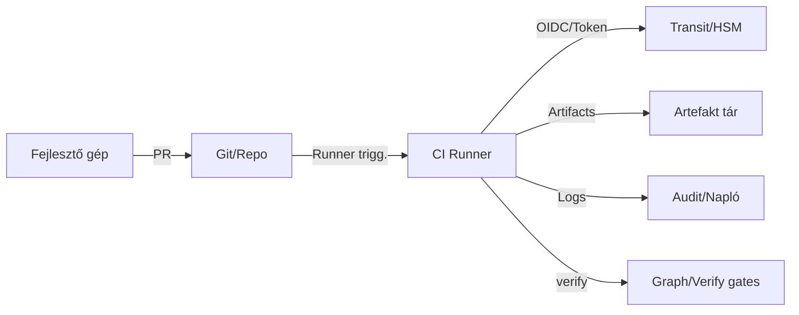

# DGP — Fenyegetési modell (HU)

> **Cél:** azonosítani, rangsorolni és kezelni azokat a kockázatokat, amelyek a DGP‑lánc (hash → aláírás → attesztáció) és a gráf‑fegyelem sérüléséhez vezethetnek.
> **Megközelítés:** eszköz‑ és vendorfüggetlen, **STRIDE‑inspirált**, bizonyíték‑első szemlélet.

---

## 0) Hatókör & feltételezések

**Scope:** docs / schemas / modules **logikai csomópontjai**, CI build‑lánc, artefakt‑tár, kulcs‑szolgáltató (Vault Transit/HSM), policy‑kapuk.

**Feltételezések (trust baseline):**

* A kulcsok **nem** hagyják el a Transit/HSM határát; a hozzáférés RBAC + rövid élettartamú tokenekkel védett.
* A CI runner kompromittálódhat **futás közben**, de nincs tartós admin‑joga az infrastruktúrában.
* A verziókezelő (git) mutációi **láthatók** (audit log), branch‑védelem aktív.
* A csapat betartja a **policy‑kapukat** (protected branch = blokkoló státuszok).

**Nem cél (out of scope):** végfelhasználói eszközök, hálózati peremvédelem, bizalmasság (DGP főként **integritásra** fókuszál).

---

## 1) Értéktárgyak (assets)

* **Proveniencia‑bizonyíték:** `MANIFEST.sha256`, `*.sig`, `attestation.json`.
* **Kulcsanyag:** aláíró kulcs Transit/HSM‑ben, hozzáférési tokenek.
* **Logikai gráf:** `*.meta.yaml`, `related_nodes`, policy‑fájlok.
* **Artefaktok:** determinisztikus csomag (`artifacts.tar`).

---

## 2) Ellenfelek & célok

* **Ellátásilánc‑támadó:** rosszindulatú változtatást szeretne észrevétlenül kiadni.
* **Belső visszaélő:** policy megkerülése, waiver visszaélése, titok kicsempészése.
* **Véletlen hibázó:** nem determinisztikus build, rossz URI, árva él.

**Motivációk:** kiadási integritás megsértése, audit félrevezetése, visszagörgetés megakadályozása.

---

## 3) STRIDE‑mátrix (DGP‑nézet)

| Kategória                  | Példa fenyegetés                  | Következmény                   | DGP ellenszer                                        |
| -------------------------- | --------------------------------- | ------------------------------ | ---------------------------------------------------- |
| **S**poofing               | Hamis aláíróként lép fel          | Hamis „zöld” kiadás            | Transit/HSM, rövid token, `verify` kulcsazonosítás   |
| **T**ampering              | MANIFEST vagy artefakt módosítása | Hash‑eltérés, rejtett injekció | Canon+hash, detached sig, `verify` fail‑shut         |
| **R**epudiation            | „Nem én adtam ki” tagadás         | Audit hiánya                   | Attesztáció (ki/mi/mikor/bemenet), immutábilis log   |
| **I**nfo disclosure        | Kulcs/meta kiszivárgása           | Kulcs‑visszaélés, profilozás   | Least‑privilege, szivárgás‑lint, titoktár RBAC       |
| **D**enial of service      | Kapuk megállítása                 | Release késik                  | „Fail‑fast” diagnózis, bypass‑mentes waiver folyamat |
| **E**levation of privilege | Runner privilégiumemelés          | Aláírás jogosulatlanul         | OIDC kötés, kötött szerepkör, network policy         |

---

## 4) Támadási utak (kill chain jelleggel)

1. **Forrás manipulálása:** PR‑ba injektált illegális URI vagy árva él → **graph‑check** megfogja.
2. **Build manipulálása:** mtime/sorvég/ZIP‑trükk → **determinista csomagolás** és hash összevetés bukik.
3. **Aláírás meghekkelése:** lokális kulcs használata → **detached sig + Transit** (nincs lokális kulcs), runner‑kötött token.
4. **Atteszt hamisítása:** kézi JSON feltöltése → **verify** sémaellenőrzés + commit/run ID egyezés.
5. **Kapuk megkerülése:** nem védett branchre push → **branch‑védelem** + release‑szabályok.

---

## 5) Kontrollkészlet (követelmény → vezérlő)

* **Integritás horgony:** kanonizált `sha256` → `hash://sha256/<digest>` kötelező.
* **Leválasztott aláírás:** `sig://vault-transit/<key>`; kulcs **sosem** hagyja el a szolgáltatót.
* **Attesztáció:** `attest://…`; CI run id + inputok; séma‑validáció a `verify` része.
* **Gráfkapuk:** `graph-check` árva/névtér/URI‑lint; **blokkoló** protected branch‑en.
* **Waiver folyamat:** időzár, két jóváhagyó, látható naplózás.
* **Artefakt‑retenció:** MANIFEST + SIG + ATTEST ≥ 90 nap (release: 1–3 év).

---

## 6) Biztonsági architektúra — határvonalak

**Megjegyzés:** kulcs‑művelet csak Vault‑ban; a runner **nem** birtokol kulcsanyagot.

---

## 7) Tipikus hibamódok & védekezés

| Jelenség            | Ok                               | Védekezés                                       |
| ------------------- | -------------------------------- | ----------------------------------------------- |
| Hash mismatch       | Nem determinisztikus kanonizálás | Fix mtime, `\n` sorvég, BOM tiltás              |
| Sig missing/invalid | Transit elérés / token gond      | RBAC, rövid token, rotáció, újrapróba szabályok |
| Attest invalid      | Sémaeltérés / hiányzó mező       | Séma‑lint, PR link + run id beemelés            |
| Orphan edge         | Rossz cél‑URI                    | `graph-check` blokkol; PR visszaküldés          |
| Namespace violation | Tiltott prefix                   | Allowlist kiterjesztés → review → commit        |

---

## 8) Metrikák (korai riasztás)

* **Árva‑ráta**, **illegális névterek** száma.
* **Determinista hash egyezés** aránya.
* **Kapufail trend** okonként (hash/sig/attest/graph).
* **Waiver‑állomány**: aktív kivételek, lejáratok.

---

## 9) Incidenskezelési jegyzet

* **Gyors igazság:** `verify_all` futtatása a kérdéses kiadásra → igen/nem válasz.
* **Hatókör:** gráf bejárása az érintett csomópontról (be/kimenő élek → blast radius).
* **Visszaállítás:** utolsó jó MANIFEST‑hash alapján determinisztikus rollback.

---

## 10) DoD ehhez a fejezethez

* Létezik **STRIDE‑mátrix** és **kill chain** nézet a DGP‑re.
* A kontrollok a 02–06 fejezetekkel **összhangban** vannak és CI‑ban mérhetőek.
* „Zöld állapot” = a fenti kontrollok aktívak + metrikák pozitív trendet mutatnak.
